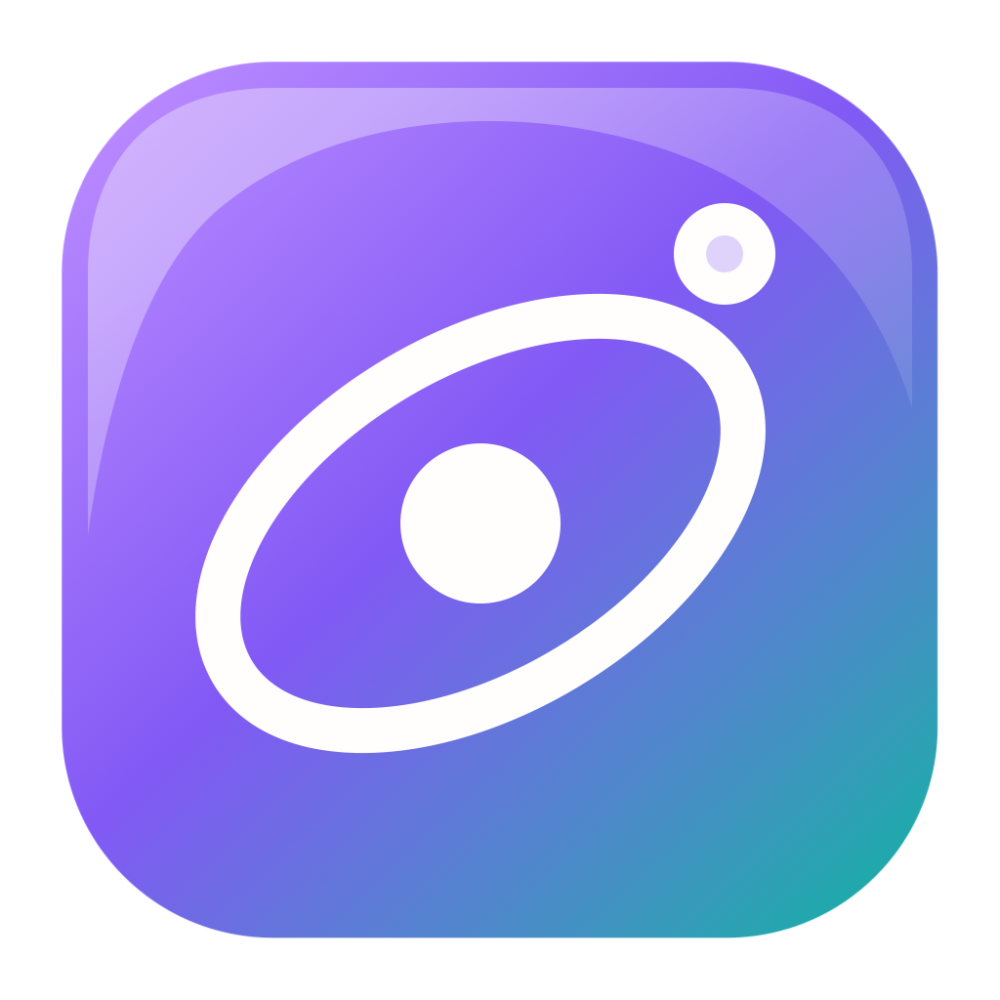
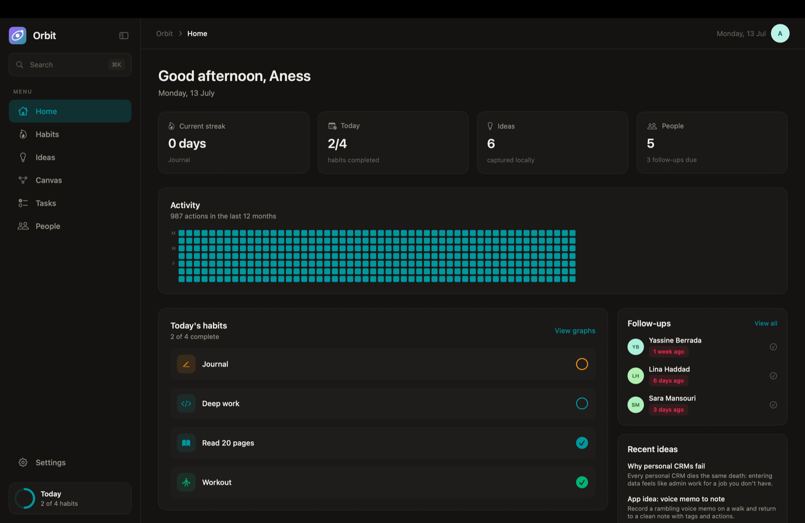

<p align="center">
  
</p>

<h1 align="center">Orbit for macOS</h1>

<p align="center">
  A private, local-first personal operating system for habits, connected ideas,<br>
  visual workflows, tasks, and relationships.
</p>

<p align="center">
  
  
  
  
</p>

Orbit brings the daily tools that usually live in separate apps into one focused Mac workspace. It preserves the structure and visual character of the original web application while replacing its browser stack with native SwiftUI, SwiftData, macOS menus, keyboard shortcuts, pointer interactions, and file panels.



## What Orbit includes

- **Home:** daily progress, activity history, current streak, due follow-ups, and recent ideas.
- **Habits:** interactive 52-week heatmaps, historical check-ins, weekly goals, and today actions.
- **Ideas:** full-text and tag search, pinning, autosaving long-form editor, and local metadata.
- **Canvas:** draggable idea cards, pan and zoom, hover connection ports, Bézier links, link deletion, and overlap merging.
- **Tasks:** list and spatial board views, hierarchical steps, recursive completion, ink, and sticky notes.
- **Workflows:** directed step graphs with native drag-to-connect ports and nested sub-workflows.
- **People:** searchable personal CRM, favorites, follow-up queue, contact details, and interaction history.
- **Command palette:** `⌘K` navigation, creation, habit logging, and direct opening of ideas or people.
- **Ownership:** appearance settings, complete JSON backup and restore, and one-action local data removal.

## A native replacement for React Flow

React Flow is a React component, so Orbit recreates its relevant behavior with a native scene architecture:

1. Nodes, notes, and ink points are persisted in world-space coordinates.
2. A shared viewport transform applies pan and zoom.
3. Nodes remain real SwiftUI views for sharp text, controls, hover, focus, and accessibility.
4. Dot grids, edges, connection previews, and pen strokes render efficiently through SwiftUI `Canvas`.
5. Geometry helpers attach Bézier curves to node borders and provide forgiving invisible hit targets.
6. Dragging a visible port creates a link; clicking a link selects it for deletion.

This keeps the central Orbit workflow intact without embedding a web view or depending on React.

## Privacy and portability

Orbit has no account, server dependency, analytics, or telemetry. Personal content is stored in a local SwiftData container. A complete, human-readable JSON backup can be exported and restored from **Settings → Data**.

## Run locally

Requirements:

- macOS 14 Sonoma or later
- Xcode 15 or later
- [XcodeGen](https://github.com/yonaskolb/XcodeGen) when regenerating the project

```sh
git clone <repository-url>
cd orbit-desktop
xcodegen generate
open Orbit.xcodeproj
```

Select the **Orbit** scheme and run on **My Mac**.

Command-line verification:

```sh
xcodegen generate
xcodebuild test \
  -project Orbit.xcodeproj \
  -scheme Orbit \
  -destination 'platform=macOS' \
  CODE_SIGNING_ALLOWED=NO
```

## Architecture

```text
Orbit/
├── App/          Application entry point and menu commands
├── Assets.xcassets/
│   └── AppIcon   Complete Retina macOS icon catalog
├── Design/       Theme tokens and shared surface styling
├── Models/       SwiftData entities
├── Services/     Seeding, JSON export, and validated restore
├── Utilities/    Date and task-completion business logic
└── Views/        App shell and feature screens
```

The project has no third-party runtime dependency. `project.yml` is the source of truth for the generated Xcode project.

## Project references

- [Product principles](PRODUCT.md)
- [Design system](DESIGN.md)
- [Complete source specification](CAHIER_DES_CHARGES.md)

## Release profile

- Bundle identifier: `com.orbit.desktop`
- Product version: `1.0.0`
- Minimum deployment: macOS 14.0
- Storage: SwiftData, local only
- Network access: not required
- App category: Productivity
