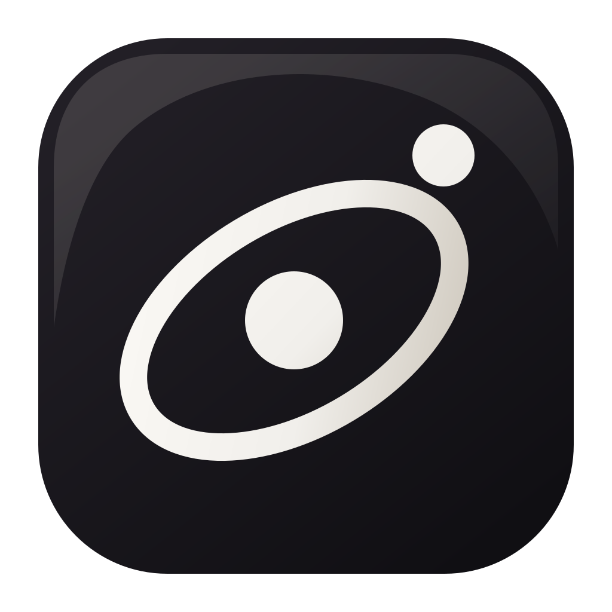

<p align="center">
  
</p>

<h1 align="center">Orbit for macOS</h1>

<p align="center">
  A private, local-first personal operating system for habits, connected ideas,<br>
  visual workflows, tasks, and workspaces.
</p>

<p align="center">
  
  
  
  
  
</p>

Orbit brings the daily tools that usually live in separate apps into one focused Mac
workspace — built with native SwiftUI, SwiftData, macOS menus, keyboard shortcuts,
pointer interactions, and file panels. No account, no server, no telemetry.

## Download

Grab the latest `Orbit.dmg` from **[Releases](https://github.com/23aneessss/orbit-desktop/releases/latest)**,
open it, and drag Orbit into Applications.

The build is not signed with an Apple Developer ID, so the first launch needs
**right-click → Open → Open**. You only do this once.

## What Orbit includes

- **Workspaces** — separate spaces for separate parts of your life. Each one has its own
  ideas, folders, tags, and canvas. Create, rename, re-icon, reorder by drag, and move a
  page between them.
- **Locked workspaces** — mark any workspace as private and it opens only after Touch ID
  (with your Mac password as fallback). Re-lock instantly with `⌘L`, and everything
  re-locks on every launch.
- **Ideas** — a Notion-style block editor with markdown shortcuts, slash commands,
  drag-to-reorder blocks, nested sub-pages, page emojis, folders, tags, and full-text
  search. Blocks can be selected with the mouse or the keyboard, then copied or deleted.
- **Canvas** — drag idea cards around an infinite grid, pull Bézier links between them,
  and overlap two cards to merge them. One canvas per workspace.
- **Tasks** — a quick-add field, and grouping by **Overdue / Today / Upcoming / No date**
  rather than a flat list. Plus a spatial board with hierarchical steps, workflow graphs,
  sticky notes, and freehand ink.
- **Habits** — interactive 52-week heatmaps, weekly goals, and one-click check-ins.
- **Home** — streak, today's habits, a year of activity, and open task count. Deliberately
  shows no note content.
- **Command palette** — `⌘K` to navigate, create, log a habit, or jump to an idea.
  Locked workspaces never surface in search.
- **Ownership** — appearance settings, complete JSON backup and restore, and one-action
  local data removal.

## Privacy

Orbit has no account, server dependency, analytics, or telemetry. Everything lives in a
local SwiftData container and a full JSON backup can be exported at any time from
**Settings → Data**.

One honest caveat about locked workspaces: the lock is a door in front of the UI, not
encryption. The store is an ordinary SQLite file, so anyone who can read that file can
read locked content without launching Orbit. It protects against someone picking up your
unlocked Mac — not against someone determined with access to your account.

## A native replacement for React Flow

React Flow is a React component, so Orbit recreates its behavior with a native scene:

1. Nodes, notes, and ink points persist in world-space coordinates.
2. A shared viewport transform applies pan and zoom.
3. Nodes stay real SwiftUI views — sharp text, focus, hover, and accessibility.
4. Dot grids, edges, connection previews, and pen strokes render through SwiftUI `Canvas`.
5. Geometry helpers attach Bézier curves to node borders with forgiving hit targets.

## Run locally

Requirements: macOS 14 Sonoma or later, Xcode 15+, and
[XcodeGen](https://github.com/yonaskolb/XcodeGen) to regenerate the project.

```sh
git clone https://github.com/23aneessss/orbit-desktop.git
cd orbit-desktop
xcodegen generate
open Orbit.xcodeproj
```

Command-line verification:

```sh
xcodegen generate
xcodebuild test -project Orbit.xcodeproj -scheme Orbit \
  -destination 'platform=macOS' CODE_SIGNING_ALLOWED=NO
```

## Architecture

```text
Orbit/
├── App/          Application entry point, window sizing, menu commands
├── Design/       Theme tokens, layout width classes, shared styles
├── Editor/       Notion-style block editor and the emoji page-icon picker
├── Models/       SwiftData entities
├── Services/     Seeding, workspace lifecycle, Touch ID locking, export/import
├── Utilities/    Date and task-completion business logic
└── Views/        App shell and feature screens
website/          Marketing site (static, deploys to Vercel from this folder)
```

The app has one runtime dependency (MarkdownUI). `project.yml` is the source of truth for
the generated Xcode project.

## Project references

- [Product principles](PRODUCT.md)
- [Design system](DESIGN.md)
- [Complete source specification](CAHIER_DES_CHARGES.md)

## Release profile

- Bundle identifier: `com.orbit.desktop`
- Product version: `1.1.0`
- Minimum deployment: macOS 14.0
- Universal: Apple Silicon and Intel
- Storage: SwiftData, local only
- Network access: not required
